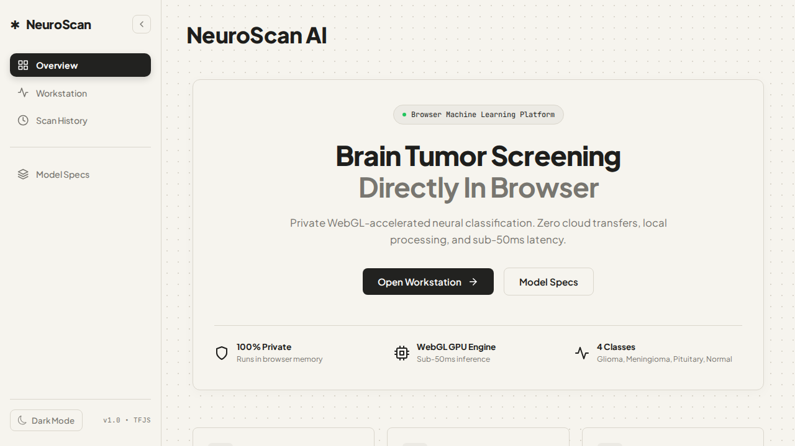
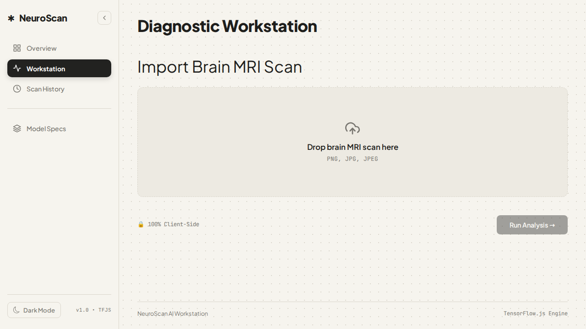
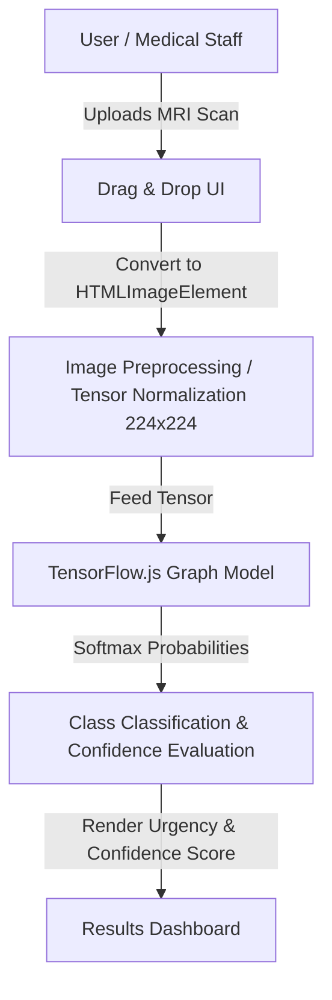

# Browser ML Tumor Detector

A client-side machine learning web application that classifies brain tumors from MRI scans directly within the browser with zero server dependencies. Built with TensorFlow.js, React, and TypeScript for private, real-time medical imaging diagnostics.

[](https://react.dev/)
[](https://www.typescriptlang.org/)
[](https://www.tensorflow.org/js)
[](https://vitejs.dev/)
[](https://opensource.org/licenses/MIT)

---

## Deployments & Live Demo

- **Live Application (GitHub Pages):** [https://auysh8.github.io/browser-ml-tumor-detector/](https://auysh8.github.io/browser-ml-tumor-detector/)
- **Live Application (Vercel):** [https://browser-ml-tumor-detector.vercel.app](https://browser-ml-tumor-detector.vercel.app)
- **GitHub Repository:** [https://github.com/auysh8/browser-ml-tumor-detector](https://github.com/auysh8/browser-ml-tumor-detector)

---

## Visual Preview

| Upload Interface | Analysis & Diagnostics |
| :---: | :---: |
|  |  |

---

## Project Overview

Brain tumor detection traditionally requires specialized software, heavy computational infrastructure, or uploading sensitive medical imagery to external cloud servers. 

**Browser ML Tumor Detector** performs deep learning inference on-device using WebAssembly/WebGL backend acceleration:
- **100% Client-Side Processing:** MRI scans are processed purely in the browser; no patient health data leaves the local machine.
- **Zero Server Infrastructure:** Completely static architecture with zero backend hosting cost.
- **Real-Time Classification:** Instant inference across 4 tumor classes (Glioma, Meningioma, Pituitary, No Tumor) plus invalid image detection.
- **Offline Capable:** Works without an active internet connection once loaded.

---

## Repository Structure

```text
browser-ml-tumor-detector/
├── public/
│   └── tfjs_model/              # Quantized TensorFlow.js neural network files
│       ├── group1-shard1of4.bin
│       ├── group1-shard2of4.bin
│       ├── group1-shard3of4.bin
│       ├── group1-shard4of4.bin
│       └── model.json           # Model topology and manifest
├── src/
│   ├── components/
│   │   ├── css/                 # CSS Modules for targeted styling
│   │   │   ├── About.module.css
│   │   │   ├── Loading.module.css
│   │   │   ├── Results.module.css
│   │   │   ├── TopBar.module.css
│   │   │   └── UploadMri.module.css
│   │   ├── About.tsx            # Project explanation and guidelines
│   │   ├── Loading.tsx          # Inference loading state view
│   │   ├── Results.tsx          # Model output visualization component
│   │   ├── TopBar.tsx           # Application navigation header
│   │   └── UploadMri.tsx        # File drag-and-drop & pre-processing handler
│   ├── App.tsx                  # Root application state & lifecycle
│   ├── main.tsx                 # Entry point
│   └── index.css                # Global base styles
├── eslint.config.js
├── index.html
├── package.json
├── tsconfig.json
└── vite.config.ts
```

---

## Architecture & Data Flow



---

## Tech Stack

| Category | Technologies |
| :--- | :--- |
| **Frontend Framework** | React 19, TypeScript, Vite |
| **Machine Learning** | TensorFlow.js (GraphModel runtime, WebGL/WASM acceleration) |
| **Styling** | Modular CSS (CSS Modules), Custom CSS, React Icons |
| **Tooling** | ESLint, TypeScript Compiler |
| **Hosting & Deployment** | Vercel, GitHub Pages |

---

## Getting Started

### Prerequisites

- Node.js (v18+ recommended)
- npm or pnpm

### Installation

1. **Clone the repository:**
   ```bash
   git clone https://github.com/auysh8/browser-ml-tumor-detector.git
   cd browser-ml-tumor-detector
   ```

2. **Install dependencies:**
   ```bash
   npm install
   ```

3. **Start development server:**
   ```bash
   npm run dev
   ```

4. Open `http://localhost:5173` in your browser.

---

## Available Scripts

| Command | Description |
| :--- | :--- |
| `npm run dev` | Starts Vite local development server |
| `npm run build` | Compiles TypeScript and builds production distribution into `dist` |
| `npm run preview` | Previews production build locally |
| `npm run deploy` | Builds and deploys the `dist` directory to GitHub Pages |

---

## Model Classification Classes

The model classifies uploaded brain MRI scans into the following categories:
- **0: Glioma** — High Urgency
- **1: Meningioma** — High Urgency
- **2: Not an MRI** — Input validation check
- **3: No Tumor** — Normal scan (No urgency)
- **4: Pituitary** — High Urgency

---

## License

This project is open-source and licensed under the MIT License. See the [LICENSE](LICENSE) file for details.

---

## Author

**Pankaj Bhandari**
- GitHub: [https://github.com/auysh8](https://github.com/auysh8)
- LinkedIn: [https://linkedin.com/in/pankajbhandari2004](https://linkedin.com/in/pankajbhandari2004)
- Email: [pankajbhandari0714@gmail.com](mailto:pankajbhandari0714@gmail.com)

