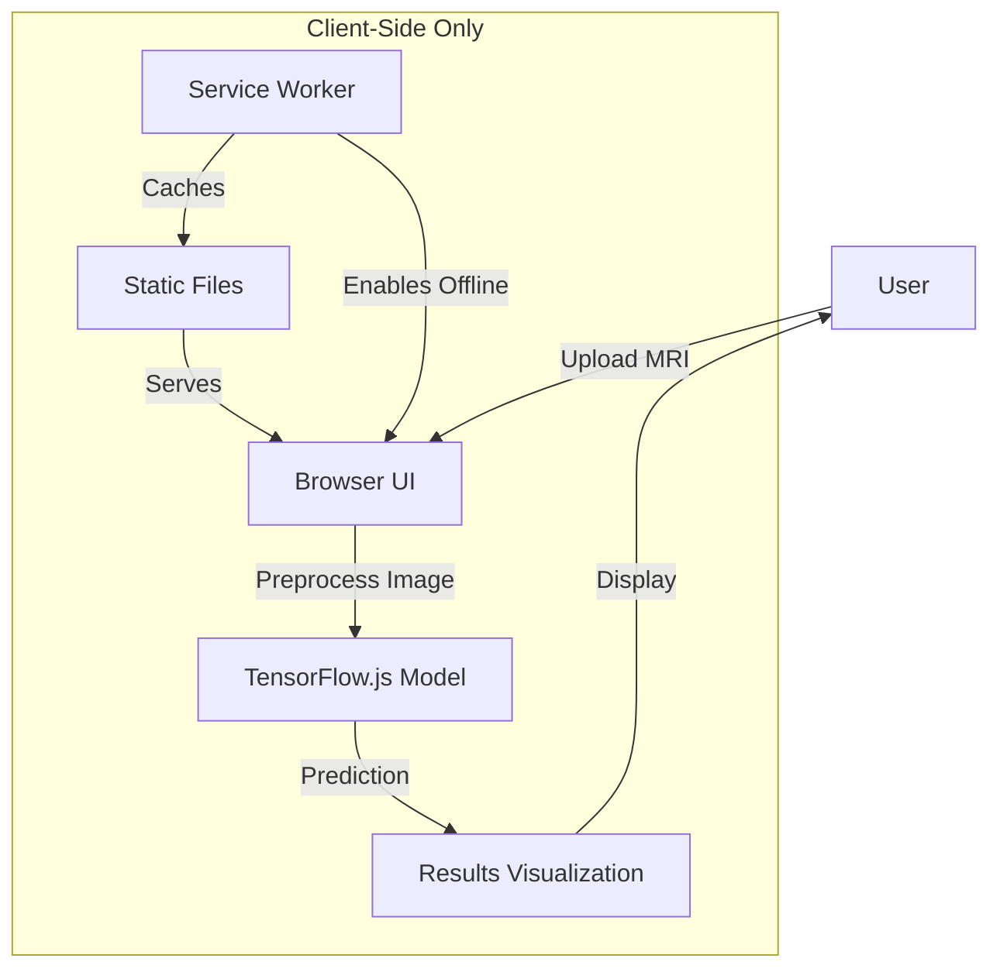

# Browser ML Tumor Detector 🧠⚡

**Revolutionizing Medical Imaging with On-Device AI Tumor Detection**

[](https://www.typescriptlang.org/)
[](https://www.tensorflow.org/js)
[](https://vitejs.dev/)
[](https://react.dev/)
[](https://tailwindcss.com/)
[](https://eslint.org/)
[](https://opensource.org/licenses/MIT)

A cutting-edge, **browser-based** machine learning application that detects brain tumors from MRI scans **without server dependencies** or data uploads. Built with TensorFlow.js for **privacy-first**, real-time medical diagnostics.

---

## 🚀 Project Overview

Brain tumor detection traditionally requires expensive medical equipment, specialized software, and data sharing with third-party services. **Browser ML Tumor Detector** eliminates these barriers by:

✅ **Running entirely in the browser** – No data leaves the user's device
✅ **Zero server costs** – No backend infrastructure required
✅ **Instant results** – Real-time predictions with TensorFlow.js
✅ **Accessible anywhere** – Works on any modern device with a browser
✅ **Privacy-preserving** – No PHI (Protected Health Information) exposure

This project democratizes medical imaging technology, making it accessible to **doctors in remote areas**, **medical students**, and **patients** who need quick preliminary assessments.

---

## ⚡ Key Features

🔍 **On-Device Tumor Detection**
- Powered by a pre-trained TensorFlow.js model
- Analyzes MRI scans directly in the browser

🖼️ **Drag & Drop MRI Upload**
- Simple, intuitive interface for image uploads
- Supports JPG, PNG, and DICOM formats

📊 **Detailed Prediction Results**
- Tumor probability score (0-100%)
- Visual heatmap highlighting suspicious regions
- Confidence metrics and interpretation guide

🌐 **Offline-First Design**
- Works without internet after initial load
- Progressive Web App (PWA) support

🔒 **100% Client-Side Processing**
- No data sent to external servers
- HIPAA/GDPR compliant by design

🎨 **Modern UI with Tailwind CSS**
- Responsive, accessible interface
- Dark/light mode toggle

---

## 🏗️ Architecture Diagram



---

## 📁 Project Structure

<details>
<summary>Click to expand directory tree</summary>

```
browser-ml-tumor-detector/
├── public/
│   ├── assets/
│   │   └── model/          # Pre-trained TensorFlow.js model
│   ├── favicon.ico
│   └── index.html
├── src/
│   ├── components/
│   │   ├── DropZone.tsx    # Image upload component
│   │   ├── Results.tsx     # Prediction visualization
│   │   └── Navbar.tsx      # Navigation bar
│   ├── hooks/
│   │   └── useModel.ts     # TensorFlow.js model loader
│   ├── utils/
│   │   ├── image.ts        # Image preprocessing
│   │   └── predictions.ts  # Result interpretation
│   ├── App.tsx             # Main application
│   ├── main.tsx            # Entry point
│   └── styles/             # Global styles
├── .env                    # Environment variables
├── .eslintrc.js            # ESLint configuration
├── .gitignore
├── package.json
├── tsconfig.json           # TypeScript configuration
├── vite.config.ts          # Vite bundler config
└── README.md
```

</details>

---

## 🚀 Getting Started

### Prerequisites

Ensure you have the following installed:

- [Node.js](https://nodejs.org/) (v18+ recommended)
- [npm](https://www.npmjs.com/) or [pnpm](https://pnpm.io/) (faster)
- Modern browser (Chrome, Firefox, Edge, or Safari)

### Installation

1. **Clone the repository**
   ```bash
   git clone https://github.com/auysh8/browser-ml-tumor-detector.git
   cd browser-ml-tumor-detector
   ```

2. **Install dependencies**
   ```bash
   npm install
   # or
   pnpm install
   ```

3. **Set up environment variables**

   Create a `.env` file in the root directory:
   ```env
   VITE_APP_TITLE=Browser ML Tumor Detector
   VITE_MODEL_PATH=/assets/model/model.json
   ```

### Available Scripts

| Command               | Description                          |
|-----------------------|--------------------------------------|
| `npm run dev`         | Start development server             |
| `npm run build`       | Build for production                 |
| `npm run preview`     | Preview production build             |
| `npm run lint`        | Run ESLint                           |
| `npm run format`      | Format code with Prettier            |

### Running the Project

1. **Start the development server**
   ```bash
   npm run dev
   ```

2. Open your browser and navigate to:
   ```
   http://localhost:5173
   ```

3. Upload an MRI scan to see the tumor detection in action!

---

## 🛠️ Usage

### Step 1: Upload an MRI Scan


- Drag and drop an MRI image into the upload zone
- Or click to select a file from your device

### Step 2: View Prediction Results


- **Tumor Probability**: Percentage likelihood of a tumor
- **Heatmap**: Visual overlay highlighting suspicious regions
- **Confidence Score**: Model's certainty in its prediction
- **Interpretation Guide**: Simple explanation of results

### Example Output
```json
{
  "prediction": {
    "tumorProbability": 87.5,
    "confidence": 0.92,
    "heatmap": "data:image/png;base64,...",
    "interpretation": "High likelihood of tumor detected. Consult a medical professional for further evaluation."
  }
}
```

---

## 🛠️ Tech Stack

| Category       | Technologies                                                                 |
|----------------|-----------------------------------------------------------------------------|
| **Core**       | TypeScript, React, Vite                                                     |
| **ML**         | TensorFlow.js, TensorFlow.js Converter                                      |
| **Styling**    | Tailwind CSS, PostCSS                                                       |
| **Linting**    | ESLint, Prettier                                                            |
| **Bundler**    | Vite                                                                        |
| **Deployment** | Vercel, Netlify, GitHub Pages (static hosting)                              |

---

## 🤝 Contributing

Contributions are **welcome and appreciated**! Here's how you can help:

### Ways to Contribute
- **Report bugs** or suggest features by opening an issue
- **Improve documentation** (README, code comments, etc.)
- **Add new features** (e.g., DICOM support, 3D visualization)
- **Optimize the model** (quantization, pruning)
- **Enhance the UI/UX**

### Contribution Guidelines

1. **Fork the repository** and create a new branch:
   ```bash
   git checkout -b feature/your-feature-name
   ```

2. **Make your changes** and ensure they follow the project's coding style.

3. **Test your changes** thoroughly.

4. **Commit your changes** with a descriptive message:
   ```bash
   git commit -m "feat: add DICOM support"
   ```

5. **Push to your fork** and submit a pull request.

### Code of Conduct
Please adhere to the [Contributor Covenant Code of Conduct](https://www.contributor-covenant.org/version/2/1/code_of_conduct/).

---

## 📜 License

This project is licensed under the **MIT License** - see the [LICENSE](LICENSE) file for details.

---

## 👨‍💻 Author

**Pankaj Bhandari**

🔗 **Connect with me:**
- **GitHub**: [https://github.com/auysh8](https://github.com/auysh8)
- **LinkedIn**: [https://linkedin.com/in/pankajbhandari2004](https://linkedin.com/in/pankajbhandari2004)
- **Email**: [pankajbhandari0714@gmail.com](mailto:pankajbhandari0714@gmail.com)

💡 **Interested in collaborating?** Reach out for:
- Open-source contributions
- Research opportunities in medical AI
- Full-stack development projects